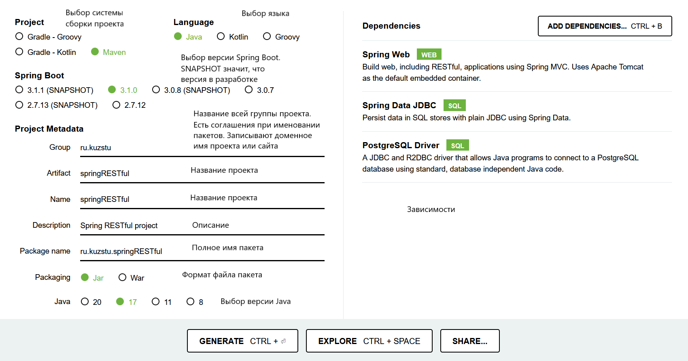
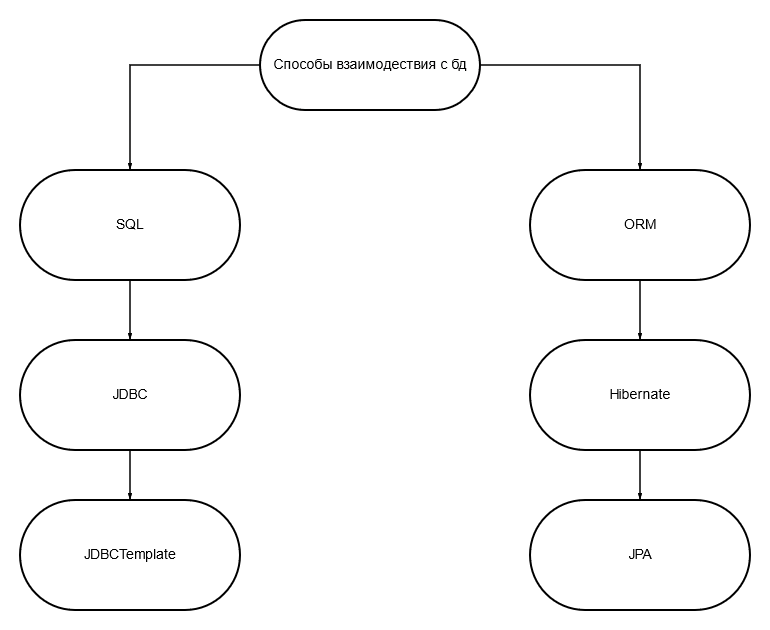

<h1>Очень краткая методичка</h1>
<h2>Создание Spring-приложения</h2><hr>   
<p>Для быстрого создания Spring Boot приложения, можно воспользоваться сайтом: <a>https://start.spring.io/</a></p>
<p></p>
<h2>ORM vs SQL</h2><hr>
<p>Существует два основных способа взаимодействия с базой данных: ORM и SQL.
<p></p>
В ORM сопоставляются классы Java с таблицами в базе данных. Hibernate — это инструмент, который как раз работает по ORM. 

В JDBC (Java Database Connectivity) нужно вручную писать sql-запросы. Вот пример классического JDBC.


```java
Connection conn = null;
try {
    String url = "jdbc:sqlite:path-to-db-file/bd/users.db";
    conn = DriverManager.getConnection(url);
    Statement stmt = null;
    String query = "SELECT * FROM users";
    try {
        stmt = conn.createStatement();
        ResultSet rs = stmt.executeQuery(query);
        while (rs.next()) {
            String name = rs.getString("name");
        }
    } catch (SQLException e) {
        throw new Error("Error", e);
    } finally {
        if (stmt != null) {
            stmt.close();
        }
    }
} catch (SQLException e) {
    throw new Error("Error", e);
} finally {
    try {
        if (conn != null) {
            conn.close();
        }
    } catch (SQLException ex) {
        System.out.println(ex.getMessage());
    }
}
```

Код довольно многословный поэтому придумали JDBCTemplate. JDBCTemplate - удобная обертка.

```java
public List<User> list() {
    String sql = "SELECT user_id, name, email, password, registration_date_time FROM users";
    return jdbcTemplate.query(sql, rowMapper);
}
```


</p>
